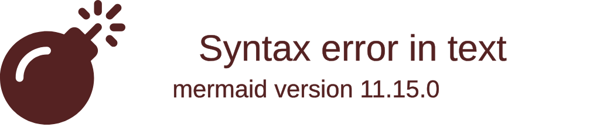

# Part0

```mermaid
info
sequenceDiagram
    participant user
    participant browser
    participant server

    user->>browser : new note and clic save
    browser->>server: POST https://studies.cs.helsinki.fi/exampleapp/new_note
    activate server
    Note right of browser: the server receives the new note data
    server-->>browser: Respuesta HTTP 201 (nota creada)
    deactivate server

    Note right of browser: browser redirect the user to the home page
    
    browser->>server: GET https://studies.cs.helsinki.fi/exampleapp/notes
    activate server
    server-->>browser: Updated HTML document
    deactivate server

    browser->>server: GET https://studies.cs.helsinki.fi/exampleapp/data.json
    activate server
    server-->>browser: JSON with all notes, including the new one
    deactivate server

    Note right of browser: The browser display all notes, including the new one
```
